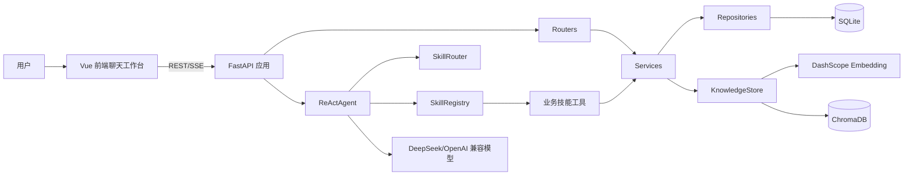

# HR Manager 概要设计文档

## 1. 项目概述

HR Manager 是一个面向企业人力资源管理的 Web 应用，提供员工、部门、考勤、请假、薪资、绩效、技能、项目与知识库等管理能力，并集成基于大模型的 HR 智能助手。系统后端采用 FastAPI 提供 REST API 与 SSE 流式对话接口，前端采用 Vue 3 构建聊天式工作台，数据默认持久化到 SQLite，知识库向量数据持久化到 ChromaDB。

## 2. 建设目标

- 提供基础 HR 主数据管理能力：员工、部门、技能目录与员工技能。
- 支持 HR 日常业务流程：考勤打卡、请假审批、薪资生成与发放、绩效周期和绩效评估。
- 支持项目用工管理：项目、技能需求、成员、工时与进度统计。
- 提供知识库检索能力：导入文本或文件后进行分块、向量化、相似度检索。
- 提供智能助手入口：用户以自然语言提问，系统按技能路由选择工具并调用业务能力完成查询或操作。
- 前端以会话式界面承载主要交互，支持流式响应、工具调用状态展示、会话列表和技能开关。

## 3. 技术架构

### 3.1 技术栈

| 层次 | 技术 |
| --- | --- |
| 后端框架 | FastAPI |
| 数据访问 | SQLAlchemy 2.x |
| 数据库 | SQLite，配置项支持替换 `database_url` |
| 数据校验 | Pydantic |
| AI 对话 | OpenAI SDK 兼容接口，默认 DeepSeek |
| 向量检索 | ChromaDB 持久化客户端 |
| Embedding | OpenAI SDK 兼容接口，默认 DashScope `text-embedding-v3` |
| 流式通信 | Server-Sent Events |
| 前端框架 | Vue 3、TypeScript、Vite |
| 前端状态 | Pinia、localStorage |
| UI 与渲染 | Element Plus、markdown-it、highlight.js |

### 3.2 总体架构

### 3.3 分层职责

| 分层 | 主要目录 | 职责 |
| --- | --- | --- |
| 应用入口 | `main.py` | 创建 FastAPI 应用、初始化数据库、注册路由、创建智能助手实例、配置 CORS |
| 配置层 | `app/config.py` | 管理数据库、大模型、Embedding、知识库与 Agent 参数 |
| API 层 | `app/routers` | 定义 HTTP 路由、请求入口和响应模型 |
| 业务层 | `app/services` | 实现业务规则、校验、跨仓储组合和响应封装 |
| 仓储层 | `app/repositories` | 封装 SQLAlchemy 会话和 ORM CRUD |
| 模型层 | `app/models` | 定义数据库表结构 |
| Schema 层 | `app/schemas` | 定义请求和响应数据结构 |
| 智能助手层 | `app/agent` | 会话管理、技能注册、技能路由、ReAct 工具调用和 SSE 流式输出 |
| 知识库层 | `app/knowledge_base` | 文档分块、Embedding、ChromaDB 存储和检索 |
| 前端层 | `frontend/src` | 聊天界面、技能面板、会话状态、API/SSE 客户端 |

## 4. 功能模块

### 4.1 基础资料模块

- 员工管理：员工增删改查、按部门补充部门名称。
- 部门管理：部门增删改查、查询部门员工。
- 技能目录管理：维护标准技能名称、类别和描述。
- 员工技能管理：维护员工技能、熟练度、经验年限和证书信息。

### 4.2 HR 业务模块

- 考勤管理：签到、签退、考勤记录查询、员工考勤统计。
- 请假管理：请假申请、查询、更新、审批、驳回、取消、假期余额查询。
- 薪资管理：薪资记录创建、月度薪资生成、列表查询、薪资发放、工资单明细。
- 绩效管理：绩效周期维护、绩效评估维护、员工绩效汇总。

### 4.3 项目管理模块

- 项目维护：项目增删改查和状态过滤。
- 技能需求：为项目配置技能、熟练度、人天和人数需求。
- 成员管理：项目成员分配、角色维护。
- 工时管理：按项目、员工和需求记录工时。
- 项目进度：汇总需求计划人天与实际工时，计算进度。

### 4.4 知识库模块

- 文档导入：支持文本和本地文件导入。
- 文档分块：按配置的 chunk size 和 overlap 切分。
- 向量化：调用 DashScope/OpenAI 兼容 Embedding API。
- 向量存储：使用 ChromaDB 持久化保存 chunk、向量和元数据。
- 检索：根据查询文本向量召回 Top K 文档片段。

### 4.5 智能助手模块

- 会话管理：内存保存多轮消息，按配置保留最大历史长度。
- 技能注册：将 HR 业务能力注册为技能和工具。
- 技能路由：根据用户问题选择需要激活的技能，减少工具列表规模。
- 工具调用：通过模型 function calling 调用业务工具。
- 流式输出：通过 SSE 推送 `message`、`tool_call`、`tool_result`、`done`、`error` 事件。
- 技能开关：通过 API 启用或禁用某个技能。

## 5. 数据架构

系统当前使用 SQLAlchemy ORM 管理业务表，默认 SQLite 文件为 `./data/hr_system.db`。主要实体包括：

- `employees`：员工基础信息。
- `departments`：部门基础信息。
- `attendance`：考勤记录。
- `leaves`：请假记录。
- `payrolls`：薪资记录。
- `performance_cycles`：绩效周期。
- `performance_reviews`：绩效评估。
- `skill_catalogs`：技能目录。
- `employee_skills`：员工技能。
- `projects`：项目。
- `project_skill_requirements`：项目技能需求。
- `project_members`：项目成员。
- `project_timesheets`：项目工时。

知识库数据独立存放在 `settings.knowledge_base_dir`，默认 `./data/knowledge_base`，集合名称为 `hr_knowledge`。

## 6. 外部接口与依赖

- DeepSeek/OpenAI 兼容聊天模型：用于智能助手回复、技能路由和工具调用。
- DashScope/OpenAI 兼容 Embedding 服务：用于知识库文档和查询向量化。
- 浏览器 localStorage：前端保存会话列表和消息缓存。

## 7. 部署与运行

### 7.1 后端启动

后端入口为 `main.py`，应用启动时会：

1. 创建 ORM 表结构。
2. 执行轻量 schema 迁移。
3. 创建 Agent、技能注册表和内存历史存储。
4. 注册业务 API 与 `/agent` API。

### 7.2 前端启动

前端位于 `frontend`，通过 Vite 运行。API 地址通过 `VITE_API_BASE_URL` 配置；未配置时使用同源地址。

## 8. 非功能设计

- 可维护性：采用 router、service、repository、model、schema 的分层结构，业务规则集中在 service。
- 可扩展性：智能助手通过 SkillRegistry 注册技能，新业务可新增 skill 文件并加入注册列表。
- 可配置性：数据库地址、模型地址、模型名称、知识库路径、分块参数和 Agent 参数均在 settings 中配置。
- 实时性：智能助手支持 SSE 流式响应，前端可增量展示回复与工具状态。
- 持久化：业务数据和向量数据持久化；Agent 会话历史当前为进程内存，服务重启后会丢失。

## 9. 当前约束

- 当前未实现认证、授权和操作审计，所有接口默认开放给允许跨域来源。
- ORM 模型中业务关联主要以整数 ID 表达，未显式声明数据库外键约束。
- 数据库迁移目前为轻量手写迁移，未引入 Alembic 等完整迁移体系。
- Agent 使用内存历史存储，不适合多实例共享会话。
- 知识库导入依赖外部 Embedding 服务，未配置密钥时相关能力不可用。
