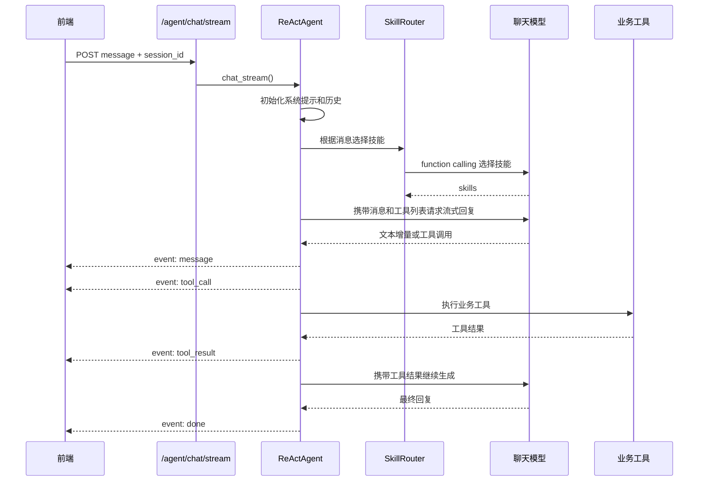
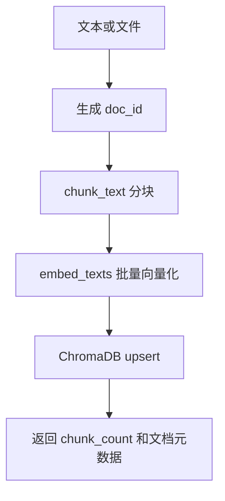

# HR Manager 详细设计文档

## 1. 代码结构

```text
hr_manager/
├── main.py                         # FastAPI 应用入口
├── app/
│   ├── config.py                   # 配置项
│   ├── database.py                 # SQLAlchemy engine/session/Base
│   ├── database_migration.py       # 轻量数据库迁移
│   ├── models/                     # ORM 模型
│   ├── schemas/                    # Pydantic 请求/响应模型
│   ├── repositories/               # 数据访问层
│   ├── services/                   # 业务逻辑层
│   ├── routers/                    # REST API 路由
│   ├── agent/                      # 智能助手、技能、路由和历史
│   └── knowledge_base/             # 文档分块、Embedding、向量存储
├── frontend/
│   └── src/
│       ├── api/                    # REST/SSE 客户端
│       ├── stores/                 # Pinia 状态
│       ├── components/             # 聊天界面组件
│       ├── views/                  # 页面
│       └── router/                 # Vue Router
├── scripts/                        # 初始化数据和知识库脚本
└── docs/                           # 设计文档
```

## 2. 后端启动流程

`main.py` 使用 FastAPI lifespan 完成初始化：

1. `Base.metadata.create_all(bind=engine)` 根据 ORM 模型创建数据库表。
2. `migrate_schema()` 执行轻量迁移，目前用于为 `employee_skills` 增加 `skill_id` 字段。
3. `create_agent()` 创建 `ReActAgent`、`SkillRegistry` 和 `InMemoryHistoryStore`。
4. 注册员工、部门、考勤、请假、薪资、绩效、员工技能、技能目录、项目和 Agent 路由。
5. 配置 CORS，允许 `http://localhost:5173` 调用后端。

需要注意：`app.agent.router` 模块内也创建了模块级 `_agent`、`_skill_registry` 和 `_history_store`。当前路由处理函数使用模块级实例；lifespan 中放入 `_app.state` 的实例未被路由函数直接使用。

## 3. 配置设计

配置类位于 `app/config.py`，通过 Pydantic Settings 读取 `.env`。

| 配置项 | 默认值 | 说明 |
| --- | --- | --- |
| `database_url` | `sqlite:///./data/hr_system.db` | 业务数据库连接串 |
| `deepseek_api_key` | 空 | 聊天模型 API Key |
| `deepseek_base_url` | `https://api.deepseek.com` | 聊天模型兼容接口地址 |
| `deepseek_model` | `deepseek-chat` | 聊天模型名称 |
| `agent_max_iterations` | `10` | 单次 Agent 最大推理/工具调用轮数 |
| `agent_max_history_messages` | `50` | 每个会话保留的最大消息数 |
| `use_skill_routing` | `True` | 是否启用技能路由 |
| `dashscope_api_key` | 空 | Embedding API Key |
| `dashscope_base_url` | `https://dashscope.aliyuncs.com/compatible-mode/v1` | Embedding 兼容接口地址 |
| `dashscope_embedding_model` | `text-embedding-v3` | Embedding 模型 |
| `knowledge_base_dir` | `./data/knowledge_base` | ChromaDB 持久化目录 |
| `knowledge_base_chunk_size` | `500` | 文档分块长度 |
| `knowledge_base_chunk_overlap` | `100` | 文档分块重叠长度 |
| `knowledge_base_search_top_k` | `5` | 默认检索条数 |

## 4. 数据库与模型设计

### 4.1 数据库连接

`app/database.py` 根据 `settings.database_url` 创建 SQLAlchemy engine。SQLite 场景下会自动创建数据库文件所在目录，并设置 `check_same_thread=False` 以便 FastAPI 请求处理使用。

### 4.2 实体表

| 表名 | ORM 类 | 关键字段 | 说明 |
| --- | --- | --- | --- |
| `employees` | `Employee` | `id`, `name`, `department_id`, `salary` | 员工基础信息 |
| `departments` | `Department` | `id`, `name`, `description`, `manager` | 部门信息 |
| `attendance` | `Attendance` | `employee_id`, `date`, `check_in`, `check_out`, `status`, `work_hours` | 考勤记录 |
| `leaves` | `Leave` | `employee_id`, `leave_type`, `start_date`, `end_date`, `days`, `status` | 请假记录 |
| `payrolls` | `Payroll` | `employee_id`, `month`, `base_salary`, `bonuses`, `deductions`, `net_salary`, `status` | 薪资记录 |
| `performance_cycles` | `PerformanceCycle` | `name`, `start_date`, `end_date`, `status` | 绩效周期 |
| `performance_reviews` | `PerformanceReview` | `employee_id`, `cycle_id`, `rating`, `rating_level`, `reviewer` | 绩效评估 |
| `skill_catalogs` | `SkillCatalog` | `name`, `category`, `description` | 技能目录 |
| `employee_skills` | `EmployeeSkill` | `employee_id`, `skill_name`, `skill_id`, `proficiency_level` | 员工技能 |
| `projects` | `Project` | `name`, `status`, `start_date`, `end_date` | 项目 |
| `project_skill_requirements` | `ProjectSkillRequirement` | `project_id`, `skill_id`, `required_proficiency`, `person_days`, `headcount` | 项目技能需求 |
| `project_members` | `ProjectMember` | `project_id`, `employee_id`, `role`, `assigned_date` | 项目成员 |
| `project_timesheets` | `ProjectTimesheet` | `project_id`, `requirement_id`, `employee_id`, `date`, `hours` | 项目工时 |

### 4.3 字典转换

所有 ORM 模型复用 `app/models/base.py` 中的 `_to_dict`，通过 SQLAlchemy inspect 提取列属性，供 repository 返回普通 dict。

## 5. 分层实现设计

### 5.1 API 层

`app/routers` 中每个文件对应一个业务模块。Router 只负责参数接收、响应模型声明和调用 service，不直接访问数据库。

### 5.2 Service 层

`app/services` 实现业务规则：

- 员工创建和更新时校验部门是否存在。
- 员工、考勤、请假、薪资、绩效、项目等响应会补充员工名、部门名、技能名等展示字段。
- 考勤签退时计算工时。
- 请假申请校验日期重叠和假期余额，审批时记录审批人和审批时间。
- 薪资支持按月批量生成，并基于考勤异常和请假信息计算扣款。
- 项目进度基于技能需求的人天和工时记录汇总。

### 5.3 Repository 层

`app/repositories` 使用 `SessionLocal()` 管理数据库会话。每个函数内部创建会话、执行查询或写入、提交事务并返回 dict 或 list。更新函数通常只更新非 `None` 字段，删除函数返回布尔值。

## 6. REST API 设计

### 6.1 员工与部门

| 方法 | 路径 | 说明 |
| --- | --- | --- |
| `GET` | `/employees/` | 查询员工列表 |
| `GET` | `/employees/{employee_id}` | 查询员工详情 |
| `POST` | `/employees/` | 创建员工 |
| `PUT` | `/employees/{employee_id}` | 更新员工 |
| `DELETE` | `/employees/{employee_id}` | 删除员工 |
| `GET` | `/departments/` | 查询部门列表 |
| `GET` | `/departments/{department_id}` | 查询部门详情 |
| `POST` | `/departments/` | 创建部门 |
| `PUT` | `/departments/{department_id}` | 更新部门 |
| `DELETE` | `/departments/{department_id}` | 删除部门 |
| `GET` | `/departments/{department_id}/employees` | 查询部门员工 |

### 6.2 考勤、请假、薪资与绩效

| 方法 | 路径 | 说明 |
| --- | --- | --- |
| `POST` | `/attendance/check-in` | 签到 |
| `PUT` | `/attendance/check-out/{record_id}` | 签退 |
| `GET` | `/attendance/` | 查询考勤列表，支持员工和日期过滤 |
| `GET` | `/attendance/{record_id}` | 查询考勤详情 |
| `GET` | `/attendance/employee/{employee_id}` | 查询员工考勤 |
| `GET` | `/attendance/employee/{employee_id}/stats` | 查询员工考勤统计 |
| `POST` | `/leaves/` | 创建请假申请 |
| `GET` | `/leaves/` | 查询请假列表，支持员工和状态过滤 |
| `GET` | `/leaves/{leave_id}` | 查询请假详情 |
| `PUT` | `/leaves/{leave_id}` | 更新请假 |
| `PUT` | `/leaves/{leave_id}/approve` | 审批通过 |
| `PUT` | `/leaves/{leave_id}/reject` | 驳回 |
| `DELETE` | `/leaves/{leave_id}` | 取消请假 |
| `GET` | `/leaves/employee/{employee_id}/balance` | 查询假期余额 |
| `POST` | `/payroll/` | 创建薪资 |
| `POST` | `/payroll/generate/{month}` | 生成月度薪资 |
| `GET` | `/payroll/` | 查询薪资列表 |
| `GET` | `/payroll/{payroll_id}` | 查询薪资详情 |
| `PUT` | `/payroll/{payroll_id}` | 更新薪资 |
| `PUT` | `/payroll/{payroll_id}/pay` | 发放薪资 |
| `GET` | `/payroll/employee/{employee_id}` | 查询员工薪资 |
| `GET` | `/payroll/payslip/{payroll_id}` | 查询工资单 |
| `POST` | `/performance/cycles/` | 创建绩效周期 |
| `GET` | `/performance/cycles/` | 查询绩效周期 |
| `GET` | `/performance/cycles/{cycle_id}` | 查询周期详情 |
| `PUT` | `/performance/cycles/{cycle_id}` | 更新周期 |
| `POST` | `/performance/reviews/` | 创建绩效评估 |
| `GET` | `/performance/reviews/` | 查询绩效评估 |
| `GET` | `/performance/reviews/{review_id}` | 查询评估详情 |
| `PUT` | `/performance/reviews/{review_id}` | 更新评估 |
| `GET` | `/performance/employee/{employee_id}/summary` | 员工绩效汇总 |

### 6.3 技能与项目

| 方法 | 路径 | 说明 |
| --- | --- | --- |
| `GET` | `/skill-catalog/` | 查询技能目录 |
| `POST` | `/skill-catalog/` | 创建技能 |
| `PUT` | `/skill-catalog/{skill_id}` | 更新技能 |
| `DELETE` | `/skill-catalog/{skill_id}` | 删除技能 |
| `GET` | `/employee-skills/` | 查询员工技能 |
| `GET` | `/employee-skills/employees/{employee_id}/skills` | 查询员工技能 |
| `GET` | `/employee-skills/by-skill/{skill_name}` | 按技能查询员工 |
| `POST` | `/employee-skills/` | 创建员工技能 |
| `PUT` | `/employee-skills/{skill_id}` | 更新员工技能 |
| `DELETE` | `/employee-skills/{skill_id}` | 删除员工技能 |
| `GET` | `/projects/` | 查询项目列表 |
| `POST` | `/projects/` | 创建项目 |
| `PUT` | `/projects/{project_id}` | 更新项目 |
| `DELETE` | `/projects/{project_id}` | 删除项目 |
| `GET` | `/projects/{project_id}/skill-requirements` | 查询项目技能需求 |
| `POST` | `/projects/{project_id}/skill-requirements` | 创建项目技能需求 |
| `PUT` | `/projects/{project_id}/skill-requirements/{req_id}` | 更新项目技能需求 |
| `DELETE` | `/projects/{project_id}/skill-requirements/{req_id}` | 删除项目技能需求 |
| `GET` | `/projects/{project_id}/members` | 查询项目成员 |
| `POST` | `/projects/{project_id}/members` | 添加项目成员 |
| `PUT` | `/projects/{project_id}/members/{member_id}` | 更新项目成员 |
| `DELETE` | `/projects/{project_id}/members/{member_id}` | 删除项目成员 |
| `GET` | `/projects/{project_id}/timesheets` | 查询项目工时 |
| `POST` | `/projects/{project_id}/timesheets` | 创建项目工时 |
| `PUT` | `/projects/{project_id}/timesheets/{timesheet_id}` | 更新项目工时 |
| `DELETE` | `/projects/{project_id}/timesheets/{timesheet_id}` | 删除项目工时 |
| `GET` | `/projects/{project_id}/progress` | 查询项目进度 |

## 7. 智能助手详细设计

### 7.1 主要类

| 类/函数 | 文件 | 说明 |
| --- | --- | --- |
| `ReActAgent` | `app/agent/react_agent.py` | 负责多轮对话、技能解析、模型调用和工具执行 |
| `SkillRouter` | `app/agent/skill_router.py` | 根据用户消息选择需要激活的技能 |
| `SkillRegistry` | `app/agent/skill_registry.py` | 注册、启用、禁用技能，查询工具列表 |
| `AgentTool` | `app/agent/protocol.py` | 封装工具名称、描述、参数 schema 和执行函数 |
| `Skill` | `app/agent/protocol.py` | 封装一个业务技能下的工具和工作流 |
| `InMemoryHistoryStore` | `app/agent/history.py` | 线程锁保护的内存会话历史 |

### 7.2 技能注册

`app/agent/skills/__init__.py` 将以下技能注册到 `SkillRegistry`：

- `core`
- `employee_skill`
- `employee_onboarding`
- `leave`
- `attendance`
- `payroll`
- `performance`
- `analytics`
- `knowledge_base`
- `project`

每个技能由名称、描述、适用场景、工具列表和可选 workflow 组成。工具最终转换为 OpenAI function calling 格式交给模型。

### 7.3 对话流程



### 7.4 SSE 事件

| 事件 | data | 说明 |
| --- | --- | --- |
| `message` | 文本片段 | 模型增量回复 |
| `tool_call` | 工具名称数组 JSON | 即将调用的工具 |
| `tool_result` | 工具名称数组 JSON | 工具调用完成 |
| `done` | 空字符串 | 本轮对话完成 |
| `error` | 错误文本 | 模型、网络或工具执行错误 |

## 8. 知识库详细设计

### 8.1 文档导入流程



`doc_id` 由 source 或 title 计算 MD5 前 12 位。每个 chunk 的 ID 为 `{doc_id}_chunk_{index}`，元数据包含 `doc_id`、`source`、`chunk_index`、`start_char` 和 `end_char`。

### 8.2 分块策略

`chunk_text` 默认使用：

- `chunk_size = 500`
- `chunk_overlap = 100`
- `stride = chunk_size - chunk_overlap`

当 chunk 末尾不是全文末尾时，会优先尝试在重叠区间内按换行符断开，以减少语义截断。

### 8.3 检索策略

查询时先调用 `embed_query` 获取 query embedding，再对 ChromaDB 集合 `hr_knowledge` 执行 cosine 检索。返回分数计算方式为：

```text
score = round(1.0 - distance / 2.0, 4)
```

返回内容包含片段文本、分数、来源、文档 ID 和 chunk 序号。

## 9. 前端详细设计

### 9.1 页面结构

前端当前只有一个路由 `/`，渲染 `ChatView.vue`。聊天页面由布局、侧边栏、消息列表、消息项、输入框、技能面板和工具调用徽标等组件构成。

### 9.2 状态管理

`frontend/src/stores/chat.ts` 使用 Pinia 管理：

- `sessions`：会话 ID 列表。
- `currentSessionId`：当前会话。
- `messages`：按 session_id 分组的消息。
- `isStreaming`：是否正在流式响应。
- `streamingMessageId`：当前流式消息 ID。
- `abortController`：用于停止当前 SSE 请求。

状态会写入 localStorage：

- `hr-chat-sessions`
- `hr-chat-messages`

### 9.3 消息发送流程

1. 用户输入文本。
2. 若当前没有会话，则前端生成 UUID 并创建会话。
3. 写入用户消息和空的助手消息。
4. 调用 `streamChat()` 连接 `/agent/chat/stream`。
5. 收到 `message` 时追加到助手消息。
6. 收到 `tool_call` 和 `tool_result` 时更新工具调用状态。
7. 收到 `done` 时结束流式状态。
8. 若服务端返回新 session id，则同步替换本地会话 ID。

### 9.4 技能面板

`frontend/src/api/skills.ts` 调用：

- `GET /agent/skills`
- `POST /agent/skills/{name}/enable`
- `POST /agent/skills/{name}/disable`

前端可展示技能名称、描述、启用状态、工具数量和工作流数量，并控制技能开关。

## 10. 核心业务规则

### 10.1 员工与部门

- 创建或更新员工时，如果传入 `department_id`，必须存在对应部门。
- 员工响应会补充 `department_name`。
- 删除员工只删除员工本身，当前未级联删除考勤、请假、薪资等关联记录。

### 10.2 考勤

- 签到创建考勤记录。
- 签退更新对应记录并计算 `work_hours`。
- 查询支持按员工、开始日期和结束日期过滤。
- 员工考勤统计由指定日期区间内记录聚合生成。

### 10.3 请假

- 请假天数由开始日期和结束日期计算。
- 创建或更新请假时校验日期重叠。
- 创建请假时校验假期余额。
- 审批通过和驳回会更新状态、审批人和审批时间。

### 10.4 薪资

- 净薪资计算公式为 `base_salary + bonuses - deductions`。
- 月度薪资生成会遍历员工，并结合考勤异常、请假记录计算扣款。
- 薪资发放会更新状态和发放日期。
- 工资单明细会补充员工、部门、扣款项等信息。

### 10.5 绩效

- 支持创建和维护绩效周期。
- 绩效评估绑定员工和绩效周期。
- 根据评分生成或维护评级等级。
- 员工绩效汇总聚合该员工历史评估。

### 10.6 项目

- 项目技能需求绑定项目与技能目录。
- 项目成员绑定项目与员工。
- 工时记录绑定项目、技能需求和员工。
- 项目进度根据计划人天和实际工时换算统计。

## 11. 错误处理设计

- Service 层通过 `HTTPException` 返回 400 或 404 等业务错误。
- Agent 工具执行通过 `_safe` 或 try/except 将异常转换为 `{ "error": "..." }`，再交给模型生成用户可读回复。
- 模型调用捕获 `RateLimitError`、`APITimeoutError` 和 `APIError`，返回对应中文错误提示。
- SSE 流程中错误通过 `event: error` 推送给前端。
- 前端 SSE 错误会标记当前助手消息 `isError` 并追加错误文本。

## 12. 扩展设计

### 12.1 新增业务模块

1. 在 `app/models` 新增 ORM 模型。
2. 在 `app/schemas` 新增请求和响应模型。
3. 在 `app/repositories` 新增数据访问函数。
4. 在 `app/services` 实现业务规则。
5. 在 `app/routers` 暴露 API。
6. 在 `main.py` 注册 router。

### 12.2 新增 Agent 技能

1. 在 `app/agent/skills` 新增 skill 文件。
2. 使用 `AgentTool` 定义工具名称、描述、参数 schema 和执行函数。
3. 使用 `Skill` 定义技能元数据、工具列表和可选工作流。
4. 在 `app/agent/skills/__init__.py` 导入并加入 `_ALL_SKILLS`。
5. 如需前端展示，技能管理接口会自动返回新增技能。

### 12.3 替换数据库

将 `.env` 中 `database_url` 改为目标数据库连接串，并确认 SQLAlchemy driver 已安装。若从 SQLite 切换到生产数据库，建议补充正式迁移工具和外键约束。

## 13. 安全与运维建议

- 增加认证和授权，至少区分普通员工、HR、审批人和管理员。
- 对薪资、绩效和员工隐私数据增加访问控制与操作审计。
- 将 Agent 会话历史改为数据库或 Redis 存储，以支持服务重启恢复和多实例部署。
- 引入 Alembic 管理 schema 迁移。
- 为外部模型调用增加超时、重试、熔断和费用限流。
- 对知识库上传增加文件类型、大小和内容安全校验。
- 为核心 service 增加单元测试，为主要 API 增加集成测试。
